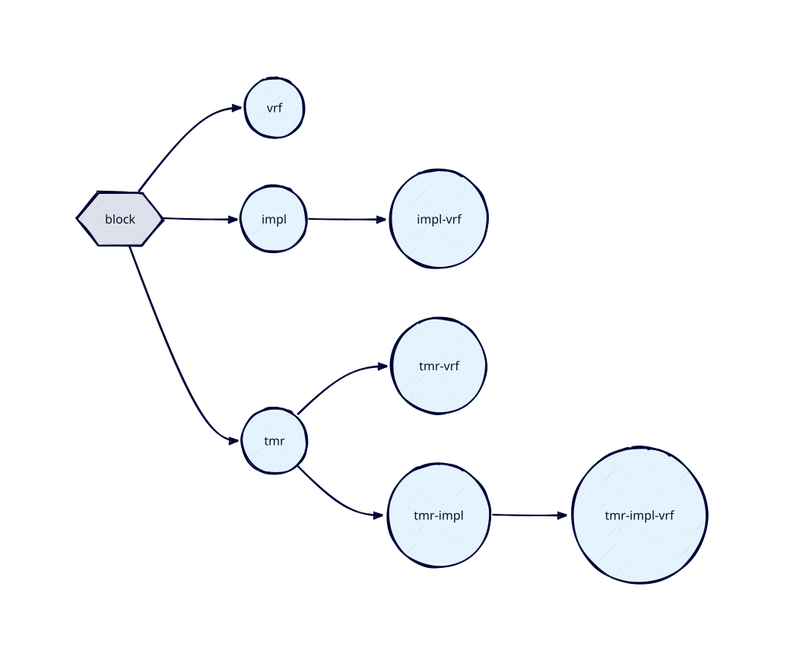

# Introduction

*bake* manages EDA flows. A digital design goes through many tool runs on its way from RTL to
a chip — simulation at every stage, synthesis, place-and-route, and whatever a project adds in
between — and each of them needs the same information: which files make up the design, what its
hierarchy is, which cell libraries it targets, which testbench drives it. *bake* keeps that
information in one place, a plain-Python `manifest`, and turns "run this recipe on this block"
into the right sequence of tool invocations with the right inputs, re-running only what changed.

## Scope and Features

*bake* automates the ASIC design process from RTL to physical implementation:

- **One description, every tool.** File lists, include directories, hierarchy, libraries,
  constraints and testbenches are declared once, in manifests, and reach every flow through
  template variables. RTL development, implementation and verification never disagree about
  what the design is.
- **Recipes over blocks.** A *block* is any design unit, from a sub-block to a full chip; a
  *recipe* is the ordered series of *steps* to run on it (`vrf`, `impl`, `impl-vrf`, ...). Steps
  hand their results on, so a simulation can run on RTL, on a synthesised netlist or on a
  placed-and-routed one with its SDF, by choosing the recipe.
- **Hierarchy and dependencies.** A block can include others as RTL or as their implemented
  results; *bake* builds what is missing or stale first, like a build system, and implements
  sub-blocks as hard macros.
- **Flows you own.** Every step runs a *flow*: a directory of scripts that *bake* copies into
  the project on first use and fills from the manifest. The scripts are yours to edit and
  version; a project can add steps and flows of its own alongside the built-in ones.
- **Any tool on `PATH`.** The built-in simulation step drives open-source simulators (Icarus
  Verilog, Verilator, cocotb) and commercial ones (Xcelium, Questa, VCS, with UVM) alike;
  the built-in implementation step runs Yosys and OpenROAD on whichever standard-cell
  libraries a manifest registers. That mix makes *bake* well suited to regression setups where
  licences and CPU time are the scarce resources.

*bake* descends from [tmake](https://gitlab.cern.ch/tmake/tmake), a build system written at
CERN for radiation-tolerant ASICs. That heritage lives on in the built-in `tmr` step, which
inserts triple-modular redundancy through an external tool (*tmrg*) so that hardened and
unhardened variants of a design can be implemented and simulated from the same manifest and
compared. It is one step among others: *bake* is a general flow manager, and most projects
will never use it.

## Theory of Operation
*bake* is built on a small set of fundamental concepts that allow users to quickly simulate their
first designs while scaling smoothly to larger projects.

*bake* follows instructions provided in `manifest` files. These are plain Python files that
communicate both design intent (files, hierarchies, interactions between components, test cases)
and flow configuration (simulator selection, synthesis scripts, custom template variables). A
manifest calls functions such as `block()`, `test()`, `env()`, `lib()`, and `flow()` to register
design objects into the *bake* registry, and sets configuration via the `config` object that is
always available in manifest scope.

*bake* operates on block and recipe combinations. A block represents any design component
(from a sub-block to a full chip), while a recipe specifies which steps to execute and in what
order. Recipes such as `vrf`, `impl`, `impl-vrf` or `tmr-impl-vrf` are parsed dynamically — any
series of known steps is a valid recipe.



*bake* performs timestamp-based dependency tracking, similar to GNU Make: a step whose outputs
are newer than its inputs is skipped, and a block that includes the implemented results of
another block has that block implemented first when its outputs are missing or stale. *bake*
also tracks the expected output artifacts of each step and reports any step that fails to
produce them.

On first invocation of a block/recipe pair, a `flow` directory is populated with a
skeleton of the flow scripts. This directory can be placed under version control, and the skeleton
files can be edited to customize any part of the flow. On subsequent invocations, *bake* reads
this directory and fills any template files (files with a `.tpl` extension). During templating,
special tokens of the form `$BAKE_XYZ` are substituted with values derived from the manifest.
Results are placed in an `output` directory corresponding to the block/recipe pair.

This approach guarantees that every part of the flow remains fully customizable (including
place-and-route scripts) while keeping design information (file names, include directories)
centralized in `manifest` files — where they can be shared between RTL development, implementation
and verification tasks.

## Step and Flow Discovery
*bake* discovers available steps automatically. Built-in steps (`vrf`, `impl`, `tmr`, `dummy`) are
located in the `bake/builtin/` directory of the package and are loaded on every invocation
without any action required from the user.

A project defines its own steps the same way: a `Step` subclass in a manifest registers itself
when that manifest is loaded. Keep each step in a directory of its own, laid out like a built-in
one (the manifest next to a `flow/` directory), and `load()` it from the project manifest:

```python
load("steps/lint")  # relative to the manifest file
```

Flows are registered by constructing a `FlowSpec` object in any manifest file. Built-in flows (one
per built-in step) are registered automatically when the built-in manifests are loaded. Custom
flows are registered by calling `flow()` in a user manifest:

```python
flow(
    name="my_sim_flow",
    simulators=[("icarus", "Icarus Verilog"), ("xcelium", "Cadence Xcelium")],
    dir="flows/my_sim_flow",
)
```

Each step has a default flow it uses when no explicit override is configured. Users can override
the flow for any step via the `config` object:

```python
config.vrf.flow = "my_sim_flow"
```

See [Custom Steps](custom_steps.md) and [Custom Flows](custom_flows.md) for complete guides.
