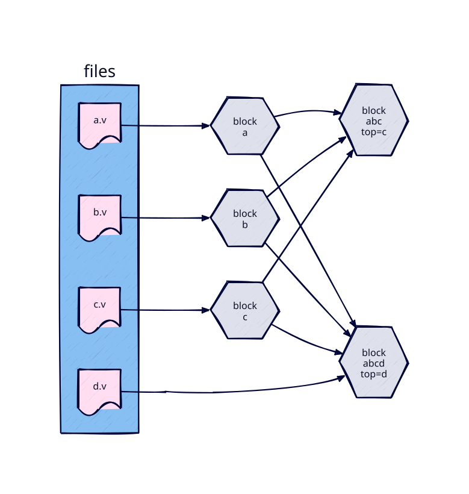
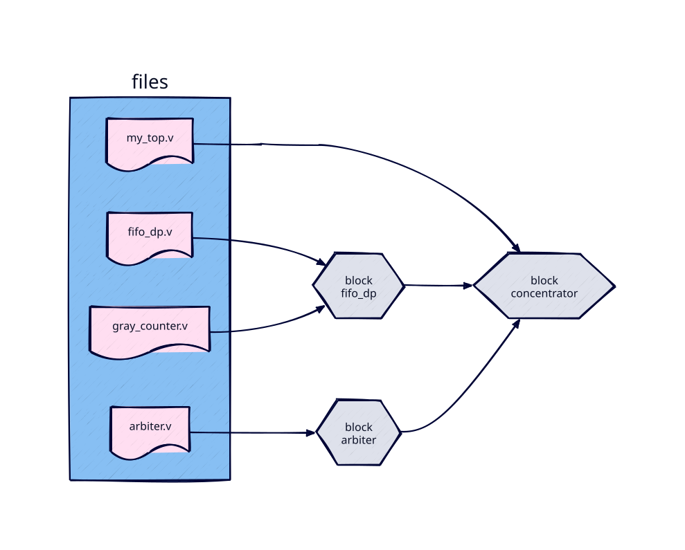

# Design Modeling
This section focuses on modeling design (RTL and implementation) related aspects using *bake*.

## Blocks
A manifest defines design units using the `block()` function. The `target` name is a
backward-compatible alias for `block` and can be used interchangeably. The full syntax is:

```python
block(name, desc, includes, top, rtl_files, rtl_incdirs, libs,
      netlist_files, netlist_incdirs, liberty_files, si_files, sdc_files,
      vcd_files, saif_files, layout_info)
```

Arguments:

  * `name` — name used to reference this block from the command line and from other manifest entries
  * `desc` — human-readable description (optional, documentation only)
  * `includes` — blocks to inherit from (see [Inheritance](#inheritance)) — optional
  * `top` — name of the top-level Verilog module for this block
  * `rtl_files` — Python list of RTL files (typically Verilog or SystemVerilog)
  * `rtl_incdirs` — Python list of include directory paths (relative or absolute) — optional
  * `libs` — Python list of *bake* library names (PDK cell libraries) — optional; a block that
    declares none uses `config.bake.default_libs`, so shared RTL can be implemented in whatever
    libraries the project that includes it sets
  * `netlist_files` — gate-level Verilog files for this block (used when the block has already been implemented externally) — optional
  * `netlist_incdirs` — include directories for netlist files — optional
  * `liberty_files` — timing libraries, same format as `lib()` — optional
  * `si_files` — signal-integrity libraries, same format as `lib()` — optional
  * `sdc_files` — design constraint files — optional
  * `vcd_files`, `saif_files` — switching-activity files for power analysis, per corner
    (`{"tt": ["run.vcd"]}`); a plain list or a single file is the `"default"` corner — optional
  * `layout_info` — LEF file or OpenAccess library folder for physical implementation — optional

## Manifest Conventions
### File References
File and directory paths in manifests can be either relative or absolute. Relative paths are
resolved relative to the manifest file they appear in, and are converted to absolute paths at
invocation time. This means downstream tools invoked by *bake* always see absolute paths.

All file and directory names are validated to exist at invocation time. This catches typos and
missing files early, before any tool is invoked. `layout_info` is the exception: it may name
several LEF files or directories separated by spaces, and one that does not exist is a warning.

Wherever a list of files is expected, a single file may be given as a string, and `pathlib.Path`
objects are accepted in place of strings. In the corner dictionaries (`liberty_files`,
`si_files`, `vcd_files`, `saif_files`) a corner may map to a single file instead of a list.

### Inheritance
Blocks (and environments, introduced later) can inherit content from other items of the same
type via an `includes` field. The item listed in `includes` is the *parent*; the newly defined
item is the *child*. Inheritance rules are straightforward:

  * Parents are processed in order of occurrence in the `includes` list.
  * For primitive (string) fields such as `top`:
    * If the child specifies a value, it overrides any parent value.
    * If the child omits the field, the first parent's value is inherited.
  * For list fields such as `rtl_files`, parent and child lists are merged:
    * Parent elements are inserted before child elements.
    * Duplicates in the merged list are removed.
    * The relative order within each list is preserved.

Examples:
```python
block(name="a", rtl_files=["a.v"])
block(name="b", rtl_files=["b.v"])
block(name="c", rtl_files=["c.v"], top="c")

block(name="abc", includes=["a", "b", "c"])
# block abc:
#   rtl_files = ["a.v", "b.v", "c.v"]
#   top = "c"  (inherited from c)

block(name="abcd", includes=["a", "b", "c"], rtl_files=["d.v"], top="d")
# block abcd:
#   rtl_files = ["a.v", "b.v", "c.v", "d.v"]
#   top = "d"  (overrides parent)
```



The `includes` field accepts either a list of block names (short form) or a dictionary mapping
block names to recipe strings (long form). The list form is a shorthand where every included
block is taken at its RTL step:

```python
# Short form — equivalent to {"a": "rtl", "b": "rtl"}
block(name="abc", includes=["a", "b"])
```

The dictionary form lets a block declare a dependency on the *output* of a specific recipe
rather than the source RTL. What the included block's recipe produced then stands in for its
RTL, and each step of the parent takes what it needs from it: `vrf` simulates the sub-block's
netlist (with its SDF), `impl` integrates the sub-block as a hard macro from its abstracts —
the LEF and Liberty files its own `impl` wrote — and passes its netlist on for the simulation
that may follow:

```python
# Long form — the sub-block is consumed after its "impl" step
block(
    name="concentrator",
    top="concentrator",
    rtl_files=["concentrator.v"],
    includes={"sub_block": "impl"},
)
```

Such an include is a *dependency*. The manifest only declares it; whether `sub_block impl` has
been run is decided when a recipe is elaborated, and the dependency is built (or rebuilt when
its sources changed) before the parent's own steps run:

```
$ bake concentrator vrf        # runs "sub_block impl" first if needed, then simulates
```

`bake` with no arguments shows the state of every dependency (`not built`, `stale`, `up to
date`), and `bake concentrator vrf -n` reports what a run would do without executing anything.
Included blocks may be defined later in the manifest; unknown blocks, unknown steps in the
recipe and include cycles are reported once all manifests are loaded.

```
$ bake concentrator impl       # hierarchical: sub_block placed as a macro
$ bake concentrator impl-vrf   # gate-level simulation of both netlists
```

A step refuses an include only when it lacks what the step needs: the built-in `impl` requires
the sub-block's abstracts, which the built-in flow writes whenever the libraries provide LEF
(synthesis-only runs produce a netlist but no macro). A block that instantiates a hard macro
cannot override its parameters — the macro's ports are fixed — so instantiate it with its
defaults. To implement the hierarchy flat instead, use the RTL form of the include.

## Hierarchical RTL Designs
Using inheritance, larger designs can be decomposed into smaller, reusable units. This keeps
manifests concise and allows simulating sub-blocks independently without duplicating file lists.

```python
block(name="fifo_dp", top="fifo_dp", rtl_files=["fifo_dp.v", "gray_counter.v"])
block(name="arbiter", top="arbiter", rtl_files=["arbiter.v"])

block(name="concentrator", top="my_top", rtl_files=["my_top.v"], includes=["fifo_dp", "arbiter"])
```



This allows independently simulating the FIFO block and running implementation on the full chip:
```
$ bake fifo_dp vrf                # RTL simulation of FIFO block
$ bake concentrator tmr-impl      # TMR + implementation of top level
$ bake concentrator tmr-impl-vrf  # TMR + implementation + gate-level simulation
```

## Blocks Without RTL Files
Blocks that declare no `rtl_files` are valid and can be registered (for example, to act as
metadata-only aggregates or library wrappers that reference only netlist/liberty data). They
do not appear in the runnable block listing and cannot be used as the target of a recipe.
This makes them useful as shared dependency containers that can be referenced via `includes`
without polluting the command-line target list.

## Libraries
The `lib()` function models any non-RTL component of a design, such as standard cell libraries
or macro blocks that have already been implemented. Libraries bundle both a simulation
representation and the information needed by implementation flows.

```python
lib(name, desc, netlist_files, netlist_incdirs, liberty_files, layout_info, si_files)
```

Arguments:

  * `name` — name used to reference this library from blocks and environments
  * `desc` — human-readable description (optional, documentation only)
  * `netlist_files` — Verilog files used to model the library during simulation
  * `netlist_incdirs` — include directories for the netlist Verilog files — optional
  * `liberty_files` — dictionary mapping corner names to Liberty files for implementation timing.
    Example: `{"TT": ["block_tt.lib"], "SS": ["block_ss.lib"], "FF": ["block_ff.lib"]}`. The
    corner names are those the implementation flow declares (`TT`, `FF`, `SS` in the built-in
    flow). A corner is in use when any library of a block provides it; every library with
    Liberty files must then provide it too, or `impl` refuses the block before running.
  * `layout_info` — LEF file or OpenAccess library folder for physical implementation — optional
  * `si_files` — SI-related (cdb) library information, same format as `liberty_files` — optional

Which fields are used depends on the step:

  * `vrf` steps use `netlist_files`; timing and layout data are ignored.
  * `impl` steps use `liberty_files`, `layout_info`, and `si_files`; netlist Verilog is ignored.
  * `tmr` steps use `netlist_files` by default.

## Loading Additional Manifests

Large projects often split their manifest across multiple files. Use `load()` to include another
manifest file from within a manifest:

```python
from bake import load

load("libs/sky130/manifest")  # relative path, resolved from this manifest's directory
```

The loaded manifest is executed in the same *bake* context, so all blocks, libs, flows, and
config changes it makes are visible to the including manifest.
