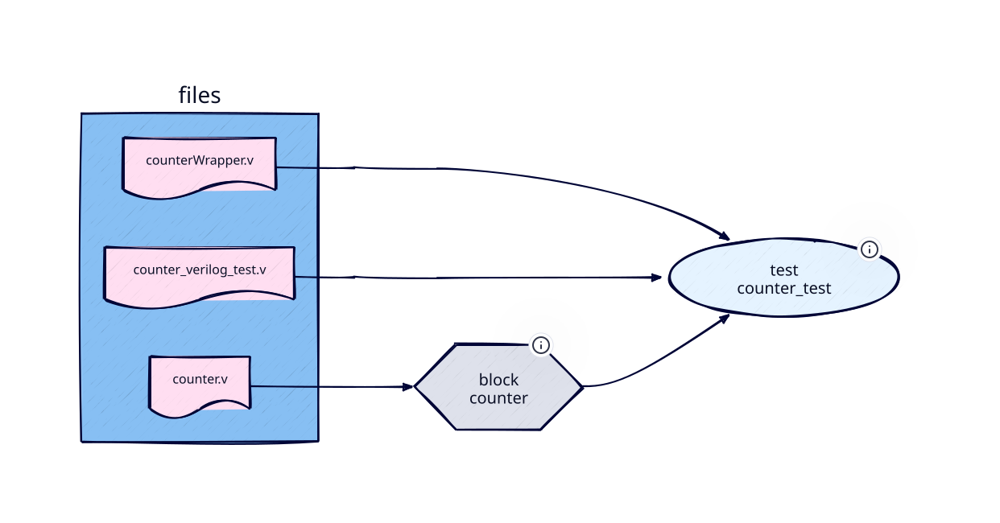

# Quick Start
This chapter gives new users a quick run-down of the most important features, glossing over technical details.

## Installation
*bake* is installed as a Python package. This tutorial also uses [Icarus Verilog](https://steveicarus.github.io/iverilog/) for
simulation and, in the last section, [tmrg](https://github.com/rlf-arlut/tmrg) for TMR insertion:

```
python3 -m venv venv
source venv/bin/activate
pip install bake-eda
```

Test the installation by invoking *bake* in the current directory:
```
$ bake
[bake] ERROR    Manifest file not found: /home/user/quickstart/manifest
```

*bake* reports that no manifest was found. Design intent is communicated via manifest files, so we need to create one before doing anything useful.

## Example Design
As a trivial example we will use a 32-bit counter and its test bench. Copy the example files shipped with *bake* to the working directory
(`example/` in the [repository](https://github.com/apatern0/bake)):

```
cp bake/example/counter/rtl/counter.v .
cp bake/example/counter/vrf/verilog/counter_verilog_test.v .
cp bake/example/counter/vrf/verilog/counterWrapper.v .
```

`counter.v` contains the RTL code for a simple up-counter. `counter_verilog_test.v` is the test bench, written in plain Verilog. `counterWrapper.v` wraps the DUT and adapts its interfaces — this is needed because TMR changes the port list of the top module, so the wrapper allows reusing the test bench for both the plain and triplicated designs. Such wrappers can be auto-generated using the *wrg* tool shipped with *tmrg*.

Now create a file named `manifest` with the following content:

```python
from bake import block, test

block(
    name="counter",
    top="counter",
    rtl_files=["counter.v"],
)

test(
    name="counter_test",
    target="counter",
    vrf_files=["counterWrapper.v", "counter_verilog_test.v"],
    default_sim="icarus",
)
```

The manifest imports the *bake* API and then declares the design block and its verification test.
No additional flow selection is needed — built-in steps (`vrf`, `tmr`, `impl`) and their flows
are loaded automatically by *bake* on every invocation.

A `block` in *bake* corresponds to an RTL unit. Here we give it a name (`counter`), specify the
top-level Verilog module name (`top`), and list the RTL files.

A `test` is associated with a block via the `target` field. It lists the verification files and
sets the default simulator to Icarus Verilog. *bake* also supports Cadence Xcelium (`xcelium`)
and Incisive (`ius`), Mentor Questa (`questa`), Synopsys VCS (`vcs`), and Verilator out of the box.



## Running bake
Invoke *bake* without arguments to see what it found:

```
$ bake
[bake] INFO     No block specified.
[bake] INFO     Available blocks and associated tests:
[bake] INFO     - counter
[bake] INFO         - counter_test
```

*bake* has read the manifest, discovered the block and its test, and verified that all referenced
files exist. It also lists the available steps:

```
[bake] INFO     Available steps:
[bake] INFO     - vrf
[bake] INFO     - tmr
[bake] INFO     - impl
```

A *recipe* is a series of steps joined by hyphens, run in order on a block. Any combination of
known steps is a valid recipe:

  * `vrf` — verification (simulation)
  * `impl` — implementation (synthesis and place-and-route)
  * `tmr` — redundancy insertion (triplication)
  * `tmr-vrf` — triplicate, then simulate
  * `tmr-impl` — triplicate, then implement
  * `tmr-impl-vrf` — triplicate, implement, then gate-level simulation

Projects can add [steps of their own](custom_steps.md) to this list.

## Running a Simulation
```
$ bake counter vrf
[bake] INFO     Auto-selecting test 'counter_test' (only test for block 'counter')
[bake] INFO     Populating flow directory for 'vrf' from '.../bake/builtin/vrf/flow' → /home/user/quickstart/flow/counter/vrf/counter_test
[bake] INFO     Running vrf on block counter
Test finished.
counter_verilog_test.v:41: $finish called at 25012500000 (1ps)
[bake] INFO     Step vrf completed in 00:00:01
```

*bake* automatically selected `counter_test` (since it is the only test available) and ran the
simulation. When more than one test is defined, specify the test explicitly with `-t`:

```
$ bake counter vrf -t counter_test
```

To override the simulator at the command line, use the `-o` flag to set a config option:

```
$ bake counter vrf -o vrf.simulator=xcelium
```

Alternatively, set the simulator for a specific test directly in the manifest:

```python
test(
    name="counter_test",
    target="counter",
    vrf_files=["counterWrapper.v", "counter_verilog_test.v"],
    default_sim="xcelium",
)
```

Two directories appeared next to the manifest. `flow/` holds the *skeleton*: the scripts for
each block/recipe/test combination, copied from the built-in flow on first use. They are yours
to edit and commit. `work/` holds everything generated when the scripts run, with the results
of each step in its `output/` subdirectory:

```
$ tree -L 4 flow/ work/
flow/
└── counter
    └── vrf
        └── counter_test
            └── run.py.tpl
work/
└── counter
    └── vrf
        └── counter_test
            ├── a.out
            ├── output/
            └── run.py
```

## Adding TMR
Run the `tmr` step alone to triplicate the design:

```
$ bake counter tmr
[bake] INFO     Populating flow directory for 'tmr' from '.../bake/builtin/tmr/flow' → /home/user/quickstart/flow/counter/tmr
[bake] INFO     Expected output files missing for step 'tmr':
[bake] INFO        - /home/user/quickstart/work/counter/tmr/output/counterTMR.v
[bake] INFO     Running tmr on block counter
[tmrg ] INFO     Running tmrg
[bake] INFO     Step tmr completed in 00:00:01
```

The triplicated output files land in the step output directory. Now run a simulation of the
triplicated design:

```
$ bake counter tmr-vrf
[bake] INFO     Output files are up-to-date, skipping step tmr.
[bake] INFO     Auto-selecting test 'counter_test' (only test for block 'counter')
[bake] INFO     Populating flow directory for 'tmr-vrf' from '.../bake/builtin/vrf/flow' → /home/user/quickstart/flow/counter/tmr-vrf/counter_test
[bake] INFO     Running tmr-vrf on block counter
Test finished.
counter_verilog_test.v:41: $finish called at 25012500000 (1ps)
[bake] INFO     Step vrf completed in 00:00:01
```

*bake* checked whether the `tmr` output is already up-to-date (it is), skipped re-running it,
and then executed the simulation. This timestamp-based dependency tracking means you never
accidentally forget to re-run *tmrg* when RTL changes, and never waste time re-running it when
only test bench files have changed.

The `counterWrapper.v` uses `ifdef TMR` and `ifdef NETLIST` guards to select the correct DUT.
*bake* automatically passes the appropriate defines for each simulation scenario.

## Cleaning Up
Clean the results of any step using the `-c` / `--clean` flag:

```
$ bake counter vrf -c
$ bake counter tmr -c
$ bake counter tmr-vrf -c
```

## Next Steps
This covers the basics of *bake*. Continue reading for design patterns, best practices, and
technical details of the manifest API:

- [Configuration](configuration.md) — customize step behaviour and set template variables
- [Design Modeling](manifest_design_model.md) — hierarchical designs, libraries, block inheritance
- [Verification Modeling](manifest_verif_model.md) — environments, UVM, cocotb, test variations
- [Custom Steps](custom_steps.md) — add your own pipeline steps
- [Custom Flows](custom_flows.md) — replace or extend built-in flow scripts
